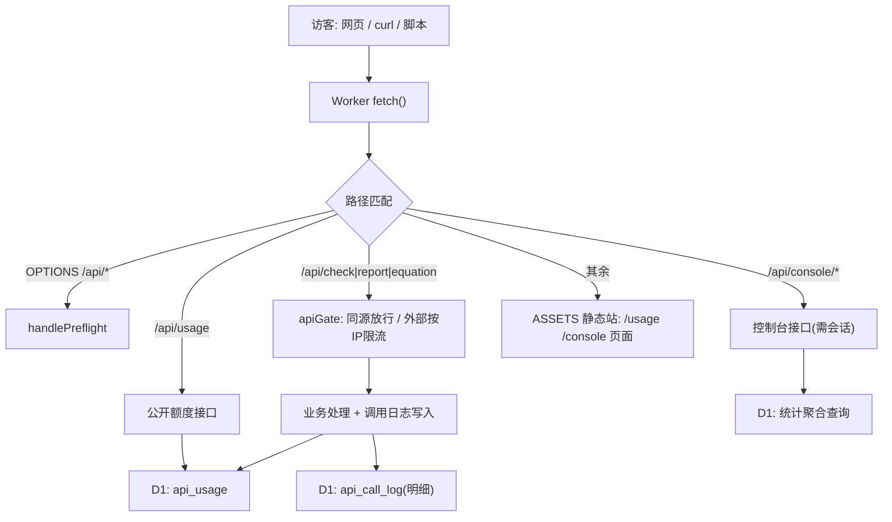

# API 控制台与额度自助

Feature Name: 2026-08-13-api-console-and-usage
Updated: 2026-08-13

## Description

将外部 API 鉴权从「静态 key（`API_KEYS` secret）」简化为「按 IP 每日 50 次的纯 IP 额度」；新增公开额度页 `/usage` 与站长控制台 `/console`（密码登录，统一查看统计与 API 配置）。

## Architecture



**关键变化**：`apiGate` 删除 `extractApiKey`/`validKeys` 校验；外部调用按 IP 限流通过后即放行。`applyCors` 的 `authorized` 语义从「持有有效 key」改为「经 apiGate 放行的外部调用」（同源调用不需要 CORS 头，与现状一致）。

## Components and Interfaces

### 后端（src/worker.js + src/chem-cache.js）

| 接口 | 方法 | 鉴权 | 说明 |
|---|---|---|---|
| `/api/usage` | GET | 无 | 返回当前 IP 额度 `{ip,used,limit,remaining,reset}` |
| `/api/console/login` | POST | 无 | body `{password}`；成功 → 下发签名 cookie `chem_console` |
| `/api/console/logout` | POST | 会话 | 清除 cookie |
| `/api/console/session` | GET | 会话 | 返回登录态（供前端初始化） |
| `/api/console/stats/summary` | GET | 会话 | 今日外部调用、累计调用、D1 缓存数、今日/累计上报数 |
| `/api/console/stats/trend` | GET | 会话 | 近 7 日外部调用趋势（`[{date,count}]`） |
| `/api/console/stats/destinations` | GET | 会话 | Referer 域名 / 地域 / UA 三组 TOP 列表 |
| `/api/console/stats/formulas` | GET | 会话 | `formula_cache` 最近更新 TOP 化学式 + 缓存总数 |
| `/api/console/stats/reports` | GET | 会话 | `report_usage` 按化学式聚合 TOP + 今日/累计总数 |
| `/api/console/config` | GET | 会话 | 展示限流参数（`API_DAILY_LIMIT=50`）、`CONSOLE_PASSWORD` 是否已配置 |

### 会话机制

无状态签名会话：`token = base64url(JSON{iat,exp}) + "." + HMAC_SHA256(payload, CONSOLE_PASSWORD)`。cookie `chem_console` 属性：`HttpOnly; Path=/; SameSite=Lax; Max-Age=604800`（7 天）。每次 `/api/console/*` 请求解析并校验签名与 `exp`；不通过 URL 传递凭据。

### 前端（public/）

| 文件 | 说明 |
|---|---|
| `public/usage.html` | 公开额度页，双语（复用 `chem_lang`/`chem_theme`），`fetch(/api/usage)` 渲染，带 5 秒自动刷新 |
| `public/console.html` | 站长控制台：登录表单 + 鉴权态后加载 5 个统计板块与 API 管理；内联脚本独立于 app.js |
| `public/styles.css` | 追加 usage/console 页面样式（沿用报告单风格） |

### 数据模型（migrations/0003_api_call_log.sql 新增）

```sql
-- 外部 API 调用明细（供目的地统计/趋势；保留近 30 天）
CREATE TABLE IF NOT EXISTS api_call_log (
  id         INTEGER PRIMARY KEY AUTOINCREMENT,
  ip         TEXT NOT NULL,
  call_date  TEXT NOT NULL,        -- YYYY-MM-DD
  referer    TEXT,                 -- 来源域名（空=无来源）
  country    TEXT,                 -- CF-IPCountry
  ua         TEXT                  -- User-Agent 摘要（截断）
);
CREATE INDEX IF NOT EXISTS idx_api_call_date ON api_call_log(call_date);
```

复用现有 `api_usage`（限流计数）与 `report_usage`（上报）。`formula_cache` 现有 `created_at/updated_at` 即可支撑物质查询统计。

## Correctness Properties

- 同源网页查询：`apiGate` 直接放行，不写 `api_usage`、不写 `api_call_log`（保持「只统计外部调用」口径）。
- 外部调用：限流计数（`api_usage`）与明细（`api_call_log`）**同批写入**——限流通过后两者都写，失败则都不写，避免明细与计数不一致。
- 限流命中：返回 429 + `X-RateLimit-Limit/Remaining/Reset` + `Retry-After`，明细不写入（未消耗额度）。
- 会话校验失败：`/api/console/*` 一律 401 `{ok:false,error}`，前端据此回到登录态。
- `api_call_log` 按 `call_date` 保留 30 天，每日清理由 `ctx.waitUntil` 异步删除过期行。
- 外部调用放行后 `applyCors` 回显来源 Origin（浏览器可读）；额度用尽后 429 响应**不设** CORS（浏览器读不到，与现有限流后行为一致）。

## Error Handling

| 场景 | 处理 |
|---|---|
| 外部调用无额度 | 429 `{ok:false,error,limit}`，带限流头 |
| 控制台密码错误 | 401 `{ok:false,error:"密码错误"}` |
| 会话过期/无效 | 401 `{ok:false,error:"未登录或会话已过期"}` |
| 未配置 `CONSOLE_PASSWORD` | 登录接口返回 500 `{ok:false,error:"控制台未配置密码"}`（不暴露细节到日志） |
| `/api/console/*` 查询 D1 失败 | 500 `{ok:false,error}`，前端显示失败占位 |

## Test Strategy

- **语法**：改动的 JS 文件 `node --check`。
- **本地 dev**：`curl http://127.0.0.1:8787` 直测（`--noproxy '*'`）：
  1. `GET /api/usage` 返回额度 JSON；
  2. 外部（带伪造 Origin）调 `/api/check` 首次放行、连续 50+ 次后 429；
  3. 同源（同 host Origin）调用不计数；
  4. 无会话访问 `/api/console/stats/summary` → 401；登录（正确/错误密码）后分别 200/401；
  5. `/console`、`/usage` 静态页 200；
  6. 各 stats 接口返回结构符合设计。
- **回归**：`/api/health` 200；网页同源查询不中断；`api_usage` 限流仍生效。

## References

[^1]: (README.md#L113-L139) - API 调用教程（key 获取段落，需随本设计改写）
[^2]: (src/worker.js#L640-L679) - `extractApiKey`/`apiGate`（本设计废止 key 校验）
[^3]: (src/worker.js#L594-L638) - `applyCors`/`sameOrigin`（authorized 语义调整）
[^4]: (src/chem-cache.js#L75-L94) - `checkAndIncrApi`（限流核心，新增明细写入）
[^5]: (migrations/0002_api_usage.sql) - api_usage 表（复用）
[^6]: (migrations/0001_init.sql) - formula_cache/report_usage（复用）
